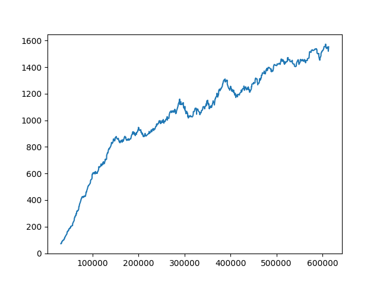

# Final Year Project

The goal of this project is compare reinforcement learning methods in their ability to train an adaptive autonomous
driving agent. 

To run this code requires a virtual environment. This can be set up using <code>conda env create -f environment.yml
</code>

<ul>
  <li>To train an agent, run "train.py"</li>
  <li>To test an agent, run "test.py"</li>
  <li>To analyse telemetry from the car, run "analyse_telemetry.py"</li>
  <li>To view/edit tracks, run "track_editor.py"</li>
</ul>

Scores from training are saved to the summaries directory, and can viewed using tensorboard

The results of training the final model are shown below, demonstrating a clear improvement in the agents ability to drive.
 
The following shows a comparison of scores for different methods of training adaptive agents. The first two agents were only 
trained to drive a single car, then tested on randomly generated cars. The next three are different methods of training
with multiple cars, including "unmasked ff", where the actor and critic are explicitly told the properties of the car it
will drive. Finally, in green is my chosen model, with uses LSTMs to remember how the cars handle, and a asymmetric
critic, to give more accurate feedback for specific cars.
 
The following is a demonstration of the racing line the agent takes, which has clearly been optimised to maximise the
speed of the car
 
Finally, due to the adaptability of the agent, it can be used to test different car configurations to compare which one
performs the best. The following are scores achieved for the center of mass being further forwards or backwards. The graph
shows that a car is fastest when the center of mass is 0.3m towards the front.
